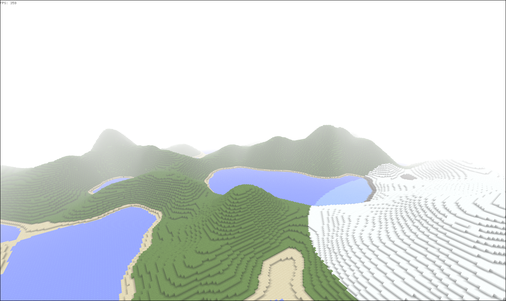
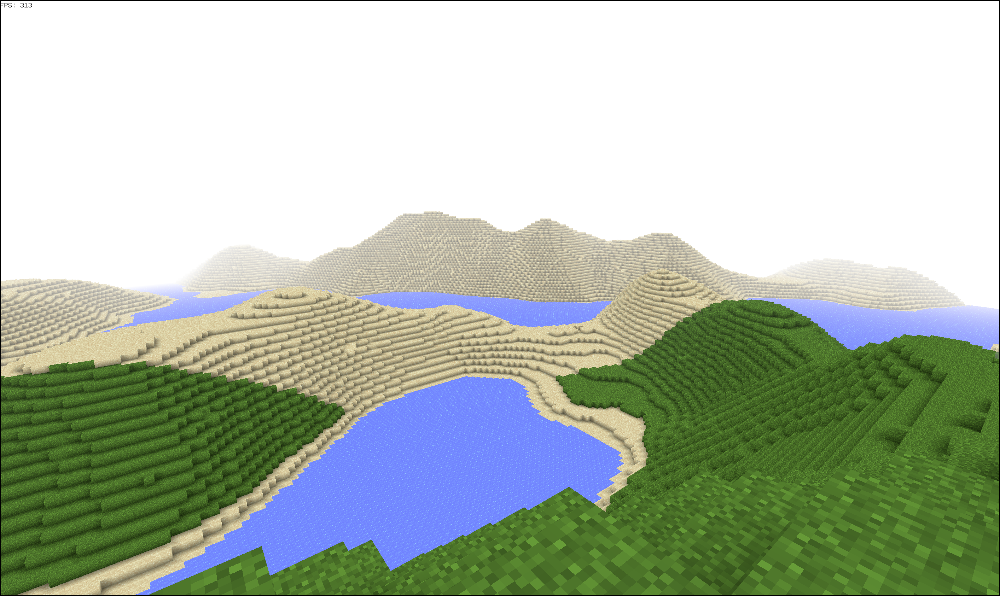
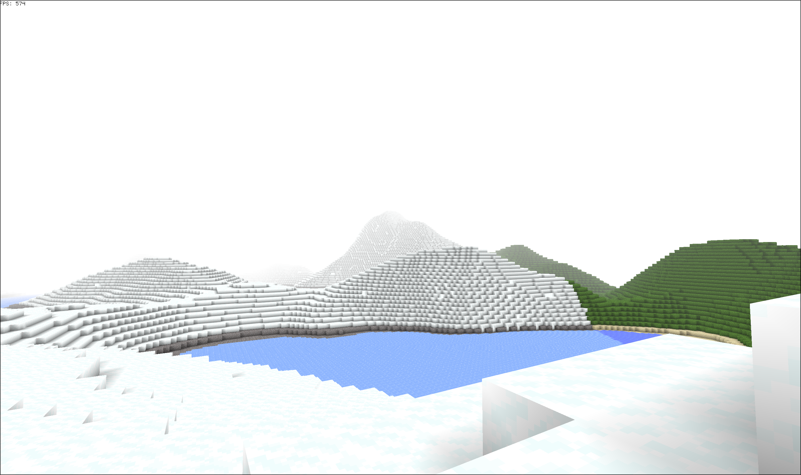

# Voxel
A performant voxel game engine built from scratch in Rust using [wgpu](https://github.com/gfx-rs/wgpu) graphics API.


## ✨ Features
- Infinite procedural world generation
- Multithreaded chunk and mesh generation
- Optimized rendering with frustum culling
- Ambient Occlusion
- Atmospheric fog


## 🖼️ Screenshots




## 🚀 Quick Start

### Prerequists
- [Rust Toolchain](https://www.rust-lang.org/)

### Installation

1. Clone the repository: 

```sh
git clone https://github.com/Aern-do/voxel.git
cd voxel
```
2. Run the project:

```sh
cargo run --release
```
